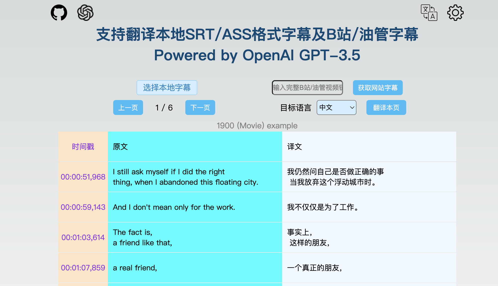

**[English](./README.md) | 中文**
# 🤖 AI Subtitle · AI字幕翻译 [ai.cgsv.top](https://ai.cgsv.top/zh-CN)

主要功能是将本地字幕文件或者B站/油管字幕翻译成你想要的语言，使用GPT-3.5作为翻译引擎。


## 功能详情
- 支持上传本地SRT/ASS格式字幕文件，以及抓取B站/油管字幕
- 支持导出原文/译文字幕到本地（目前支持导出SRT格式）
- 翻译引擎支持GPT-3.5或Google Translate
- 支持所有常见语言的互译



## 工作原理

- 使用[OpenAI GPT-3.5 API](https://openai.com/api/)作为翻译引擎
- 使用[NextJS](https://nextjs.org/)和[Vercel Edge functions](https://vercel.com/features/edge-functions) 开发，并在[Vercel](https://vercel.com/)部署
- 使用[Upstash](https://console.upstash.com/) Redis做缓存和限流

## 注意事项

- 请尽量使用自己OpenAI key,会更加稳定（本项目不会存储用户的key）
- 翻译完整字幕文件需要较多token，请注意token用量
- 翻译完整字幕文件可能耗时较长，请不要关闭当前浏览器窗口

## 本地运行

复制本项目到本地后，参考.example.env文件创建一个自己的.env,补全需要的环境变量

然后，在命令行运行如下命令，成功后可在 `http://localhost:3000` 预览

```bash
npm run dev
```

## 部署到Vercel

[](https://vercel.com/new/clone?repository-url=https://github.com/cgsvv/AISubtitle&env=OPENAI_API_KEY&project-name=ai-subtitle&repo-name=ai-subtitle)

## 支持与联系

WeChat: cgsvvv

Email: cgsv@qq.com
