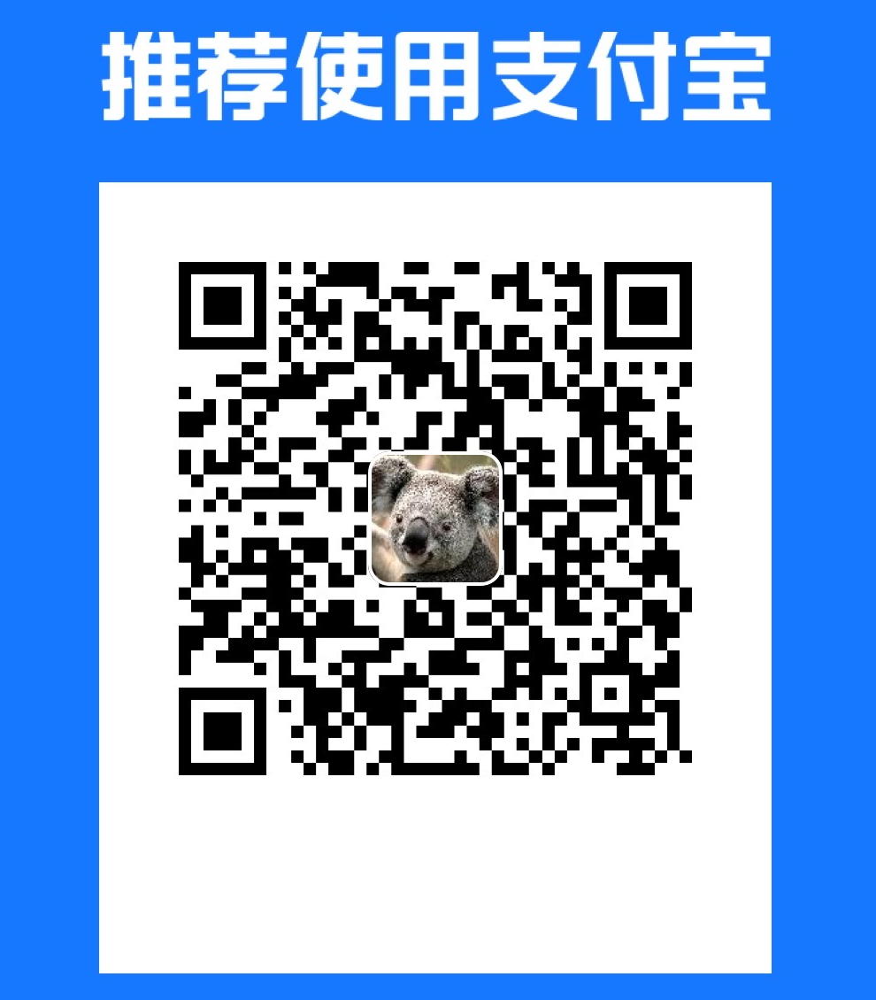

**[中文](./README-CN.md) | English**

# 🤖 AI Subtitle Translation [ai.cgsv.top](https://ai.cgsv.top/en)

The main function is to translate local subtitle files or Bilibili/YouTube subtitles into the language of your choice using GPT-3.5 as the translation engine.

## Function Details

- Support uploading local SRT/ASS format subtitle files and grabbing Bilibili/YouTube subtitles
- Translate part of the text and display the translation in real-time:
- Support exporting original/translated subtitles to local (currently only support SRT format)
- Translation engine supports GPT-3.5 or Google Translate
- Support mutual translation of all common languages


## How it works

- Using [OpenAI GPT-3.5 API](https://openai.com/api/) as the translation engine
- Developed with [NextJS](https://nextjs.org/) and deployed on [Vercel](https://vercel.com/) with [Vercel Edge functions](https://vercel.com/features/edge-functions)
- Using [Upstash](https://console.upstash.com/) Redis for caching and rate limiting

## Notices

- Please try to use your own OpenAI key for more stability (this project will not store user keys)
- Translating complete subtitle files requires a large number of tokens, please pay attention to token usage
- Translating complete subtitle files may take a long time, please do not close the current browser window

## Run locally

After copying this project to your local machine, create your own .env file based on the .example.env file and complete the required environment variables.

Then, run the following command in the terminal. Once successful, you can preview the project at http://localhost:3000.

```bash
npm run dev
```

## One-Click Deploy

[](https://vercel.com/new/clone?repository-url=https://github.com/cgsvv/AISubtitle&env=OPENAI_API_KEY,UPSTASH_REDIS_REST_URL,UPSTASH_REDIS_REST_TOKEN,UPSTASH_RATE_REDIS_REST_URL,UPSTASH_RATE_REDIS_REST_TOKEN&project-name=ai-subtitle&repo-name=ai-subtitle)

## Contact Me

Email: cgsv@qq.com

<details>
<summary><h2>Support</h2></summary>

<div align="left">
    
    
</div>
</details>

<a href="https://www.buymeacoffee.com/cgsv" target="_blank"></a>

